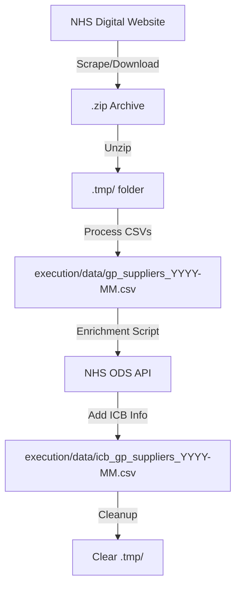

# 🏥 NHS GP System Extraction & Reconciliation - User Guide

This guide details the two-stage process of harvesting national healthcare data and reconciling it with local commissioner information.

---

## 📖 Table of Contents
1. [Overview](#-overview)
2. [Getting Started](#-getting-started)
3. [Core Functionality](#-core-functionality)
4. [Data Pipeline](#-data-pipeline)
5. [Enrichment Process](#-enrichment-process)
6. [Troubleshooting](#-troubleshooting)
7. [API Reference (Programmatic)](#-api-reference)

---

## 🔍 Overview

The tool follows a specific mission: bridge the gap between **national activity data** and **local commissioning structure**.

1.  **Stage 1: Extraction**: We scrape the NHS "Appointments in General Practice" logs to extract which IT system each GP practice uses. This data is otherwise buried in monthly reporting CSVs.
2.  **Stage 2: Reconciliation**: We reconcile these extracted practices with their "Commissioned By" (ICB Sub-location) data using the NHS ODS API.

The result is a unified, searchable database of GP systems aligned by commissioner.

---

## 🚀 Getting Started

### Prerequisites
- Python 3.9+
- Internet access (for download and ODS API lookup)

### Installation
1. **Clone & Install**:
   ```powershell
   git clone https://github.com/your-repo/extraction-reconciliation.git
   cd extraction-reconciliation
   pip install -r requirements.txt
   ```

---

## ⚙️ Extraction & Reconciliation Process

### 1. National Data Extraction
The `download_gpad.py` script performs the heavy lifting:
- Scrapes NHS Digital for the latest dataset.
- Unpacks raw "Practice Level Crosstab" CSVs.
- Extracts ODS codes and their primary IT system.

```powershell
python execution/download_gpad.py --month 2025-01
```

### 2. Commissioner Reconciliation
The `enrich_gp_data.py` script takes the extracted list and reconciles it with ICB data:
- Uses the **NHS ODS API** to find the "Commissioned By" (RE4 relationship) for each ODS code.
- Merges this with existing local maps to create a final, enriched dataset.

```powershell
python execution/enrich_gp_data.py --month 2025-01
```

---

## 🛠 Core Functionality

### 1. Querying GP Data
The primary tool for interaction is `execution/gp_lookup.py`.

| Action | Command |
| :--- | :--- |
| **Lookup by ODS** | `python execution/gp_lookup.py --ods-code A81001` |
| **Search by Name** | `python execution/gp_lookup.py --name "SURGERY"` |
| **Filter by System** | `python execution/gp_lookup.py --system TPP` |
| **Get Statistics** | `python execution/gp_lookup.py --stats` |
| **Export to JSON** | `python execution/gp_lookup.py --ods-code A81001 --output json` |

### 2. Updating the Database
New data is released monthly by NHS Digital. To update your local database:

```powershell
python execution/download_gpad.py --month 2025-01
```

> [!TIP]
> If you encounter CloudFlare blocking, you can provide a direct zip link:
> `python execution/download_gpad.py --month 2025-01 --zip-file https://files.digital.nhs.uk/path/to/data.zip`

---

## 🧬 Data Pipeline

The following diagram illustrates how raw NHS data is processed into our structured format:



---

## ⚡ Enrichment Process

The `enrich_gp_data.py` script adds **ICB Sub location** information to the GP records.

1. It checks the local `GP to ICB Sub location - Map.csv` first.
2. If the ODS code is missing, it calls the **NHS ODS API (RE4 relationship)**.
3. It updates the local map to speed up future runs.

---

## ❓ Troubleshooting

### CloudFlare / Access Denied
**Issue**: The scraper fails to download from the NHS website.
**Solution**: 
1. Open the [NHS Appointments Page](https://digital.nhs.uk/data-and-information/publications/statistical/appointments-in-general-practice) in your browser.
2. Find the "Annex 1 - Practice Level Crosstab" link.
3. Right-click and "Copy link address".
4. Run: `python execution/download_gpad.py --month YYYY-MM --zip-file [PASTED_URL]`

### Missing Columns in Output
**Issue**: NHS Digital occasionally changes their CSV headers.
**Solution**: Check `execution/download_gpad.py` (lines 210-230) and ensure the column indices match the new CSV structure found in `.tmp/`.

---

## 💻 API Reference

You can integrate the lookup logic directly into your Python projects:

```python
from execution.gp_lookup import GPSupplierLookup

# Initialize (automatically finds the latest data file)
lookup = GPSupplierLookup()

# Single practice lookup
practice = lookup.lookup_by_ods_code("A81001")
if practice:
    print(f"Name: {practice['GP_NAME']}")
    print(f"System: {practice['GP_SYSTEM']}")

# Bulk filtering
tpp_list = lookup.filter_by_system("TPP")
print(f"Total TPP practices: {len(tpp_list)}")
```

---

*This guide is maintained by the project contributors. For issues, please open a GitHub Issue.*
